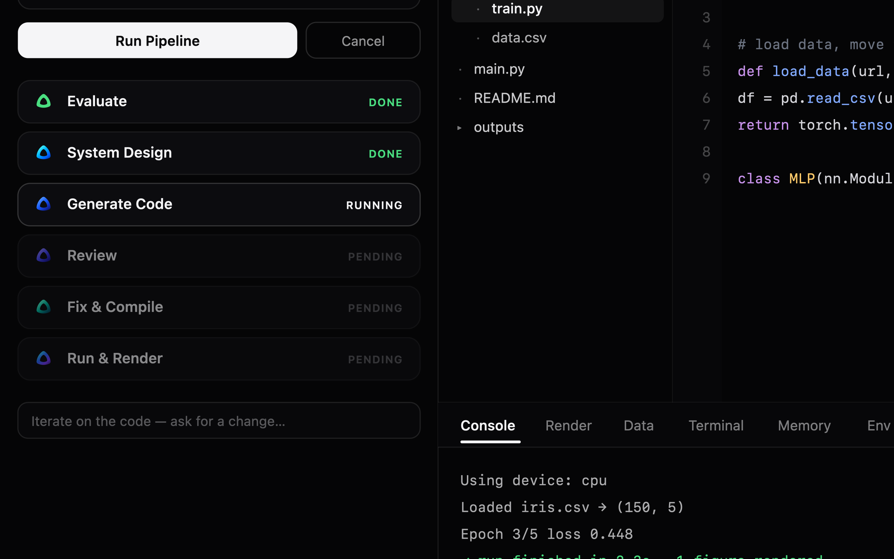

<div align="center">


# Cicada

**An agentic Python IDE that turns plain-English requests into runnable, executed code — powered entirely by a local model.**

[](#license)
[](#requirements)
[](https://www.electronjs.org/)
[](https://www.python.org/)
[](https://github.com/ggerganov/llama.cpp)
[](#about)
[](#)

`local-llm` · `agentic-ide` · `electron` · `python` · `llama-cpp` · `gguf` · `code-generation` · `monaco-editor` · `machine-learning` · `offline-first`

</div>

---

## About

**Cicada** is an [Electron](https://www.electronjs.org/) desktop IDE that lets you describe a
program in plain text and watch it become **runnable, executed Python** in the editor. Every
stage of reasoning runs on your machine through a local GGUF model
(`mythos-nano`, a Qwen2-architecture reasoning model) served by
[`llama-server`](https://github.com/ggerganov/llama.cpp) — **no API keys, no cloud, no data
leaving your machine.**

Instead of a single prompt-to-code shot, Cicada runs your request through a **six-stage agentic
pipeline** (evaluate → design → generate → review → fix → run) so the output is not just
plausible-looking code but code that has been review-checked, compile-checked, and actually
executed — with plots and output rendered back in the UI.

It is aimed at **non-developers, beginners, researchers, data scientists, and system designers**
who want to prototype, experiment, learn, and build and test small ML / deep-learning models in
Python — without wiring up a toolchain or sending their data to a third party. A swipeable
welcome tour introduces the IDE on first launch (reopen it anytime from the ✦ button in the top
bar).

<div align="center">
  
  <br/>
  
</div>

## Table of Contents

- [About](#about)
- [Highlights](#highlights)
- [The Pipeline](#the-pipeline)
- [Features](#features)
- [Tech Stack](#tech-stack)
- [Requirements](#requirements)
- [Getting Started](#getting-started)
- [Verify the Core (no UI)](#verify-the-core-without-the-ui)
- [Project Layout](#project-layout)
- [Notes](#notes)
- [License](#license)

## Highlights

- 🔒 **100% local & offline** — inference runs through `llama-server` on `127.0.0.1`; nothing is uploaded.
- 🧠 **Agentic, not one-shot** — a six-stage pipeline reviews, compiles, and runs the code it writes.
- 📝 **Plain English → executed Python** — describe it, get runnable output, plots, and stdout/stderr.
- 🗂️ **Single file or a real repo** — generate one `main.py` or a full multi-file project.
- ✂️ **⌘K Edit Selection** — agentic inpainting that rewrites only the lines you select, safely.
- 📊 **Bring your own data** — drag in CSV/Excel/JSON; the schema is analyzed locally and fed to the agent.
- 🧩 **Frontier ML/DL ready** — uses whatever is installed (PyTorch, TensorFlow, JAX, scikit-learn, …).

## The Pipeline

```
User prompt
   -> Evaluate        (goal, inputs, outputs, constraints, edge cases)
   -> System Design   (approach, functions, data flow, libraries)
   -> Generate Code   (one self-contained main.py, OR a multi-file project — your choice)
   -> Review          (concrete correctness issues)
   -> Fix & Compile   (apply review + py_compile loop, auto-retried)
   -> Run & Render    (execute; stream stdout/stderr; surface plots/images)
```

Each stage is a focused call to the local model. Because `mythos-nano` is a reasoning model, its
`<think>` reasoning is separated from the answer and shown in a collapsible panel per stage; the
final code is extracted from the answer's fenced block.

## Features

- Local-only inference via `llama-server` (OpenAI-compatible API on `127.0.0.1`).
- Monaco editor (the VS Code editor) with Python syntax highlighting.
- **Single file or a real repo.** An **Output** toggle in the Agent panel lets you choose
  how the agent structures a *new* program: one self-contained `main.py` (the classic
  behaviour), or a proper multi-file project — packages and modules with an `__init__.py`
  in every package, absolute imports rooted at the project, a runnable `main.py` entry
  point, and an optional `requirements.txt`. In repo mode the whole project is written to
  the workspace, every module is compile-checked, the entry point is run, and the
  fix/repair loops operate across all files; *Iterate on the code* then applies changes
  across the whole project. The choice is remembered (`agentOutputMode` in config).
- **Edit Selection — agentic inpainting.** Select a region of code, press **⌘K** (or
  the *Edit Selection* button / right-click → *Cicada: Edit Selection*), and describe a
  change. The agent rewrites **only that region** and splices it back at the exact lines.
  Three safety layers keep it from introducing bugs: the region is resolved to whole
  lines, the replacement is re-indented to the region's nesting level (no
  `IndentationError`), and the whole file must still compile — it auto-heals, and if it
  cannot reach a compiling result it **reverts the selection** so your file is never left
  broken. A runtime crash triggers a region-scoped repair, never a whole-file rewrite.
- **Real context memory.** A persistent project memory (`workspace/.garm/memory.json`)
  remembers what the program is, durable facts/decisions you pin, and recent activity —
  across requests and across restarts. It is injected into every agentic prompt for
  continuity and is visible/editable in the **Memory** dock tab.
- **Full Python + frontier ML/DL support.** Generated code can use any library installed
  in the configured interpreter — PyTorch, TensorFlow, JAX, scikit-learn, transformers,
  OpenCV, pandas, and the rest. Cicada probes the interpreter on launch, tells the model
  exactly what is importable (so it uses the real stack, with device/epoch guidance for
  deep learning), and shows it all in the **Env** dock tab grouped by category with
  versions. Anything missing installs with one click (or type any package name). When a
  run hits a `ModuleNotFoundError`, Cicada surfaces the exact `pip install` instead of
  wasting fix iterations on correct-but-uninstalled code.
- **Document ingestion — bring your own data.** Drag &amp; drop **CSV, Excel (.xlsx/.xls),
  and JSON** anywhere in the window, or use **Add data…** in the **Data** dock tab. Each file
  is validated, copied into the project's `data/` folder, and analyzed *locally* through your
  own Python interpreter (pandas when available, stdlib otherwise — no uploads): Cicada detects
  the schema/structure (columns, data types, null counts, numeric stats, unique values, sheet
  names, nested-JSON shape) and indexes it in `workspace/.garm/datasets.json`. The Data tab
  shows each file's schema, a sample preview, and a copy-ready load snippet. Crucially, the
  detected schema is injected into every agentic prompt **and** the chat context, so the agent
  can inspect, summarize, and reason over your data — and build analytics programs, dashboards,
  reports, transformations, pipelines, visualizations, or ML workflows directly from the real
  files (e.g. drop a sales CSV, then ask for "a full sales analytics report with charts").
- Console with live stdout/stderr streaming and a stdin box for interactive programs.
- Render panel that displays any images/plots the program produces (matplotlib figures
  are auto-captured via a headless harness).
- Integrated terminal (xterm.js) running in the workspace, with command history and `cd`
  persistence.
- Compile (syntax) checks and a Problems panel.
- Settings for model path, server port, context size, GPU layers, sampling, and the
  number of auto-fix iterations.

## Tech Stack

| Layer | Technology |
| --- | --- |
| Desktop shell | [Electron](https://www.electronjs.org/) 33 |
| Editor | [Monaco](https://microsoft.github.io/monaco-editor/) (the VS Code editor) |
| Terminal | [xterm.js](https://xtermjs.org/) (`@xterm/xterm` + fit addon) |
| Math rendering | [KaTeX](https://katex.org/) |
| Local inference | [llama.cpp](https://github.com/ggerganov/llama.cpp) `llama-server` |
| Model | `mythos-nano` (Qwen2-architecture reasoning model, GGUF) |
| Runtime / execution | Python 3 (compile, run, matplotlib harness, env detection) |

## Requirements

- macOS (Apple Silicon recommended) or Linux.
- `llama.cpp` providing `llama-server` on your `PATH`
  (`brew install llama.cpp`). Override with `GARM_LLAMA_SERVER=/path/to/llama-server`.
- A `.gguf` model. Defaults to `~/Downloads/mythos-nano-Q4_K_M.gguf`; change it in Settings.
- Python 3 on your `PATH` (used for compile + run).
- Node.js 18+ (for Electron).

> **Note:** the `.gguf` model file and `config.json` are intentionally **not** committed to this
> repository (the model is ~1.9 GB and exceeds GitHub's file-size limit). Download the model
> separately and point Cicada at it in Settings.

## Getting Started

```bash
npm install
npm start
```

On launch, Cicada starts `llama-server` with the configured model and shows
"Model ready" once it is loaded. Type a request in the Agent panel and press
**Run Pipeline** (or Cmd/Ctrl+Enter). You can also write Python directly in the
editor and press **Run**.

The workspace (generated `main.py`, outputs, plots) lives in
`~/GARM Code/workspace`. Settings persist to `~/GARM Code/config.json`.

## Verify the core without the UI

```bash
node scripts/check.js          # syntax-check all source files
node scripts/inpaint_test.js   # deterministic splice/indent + py_compile checks (no model)
node scripts/memory_test.js    # persistent context-memory checks (no model)
node scripts/llm_test.js       # response parsing incl. the <think>-leak guard (no model)
node scripts/env_test.js       # library detection + ModuleNotFoundError -> pip mapping
node scripts/headless_test.js "Print the first 10 Fibonacci numbers, one per line."
node scripts/refine_test.js    # post-edit refine (needs the model)
node scripts/inpaint_e2e.js    # end-to-end select-and-replace (needs the model)
node scripts/stress_test.js    # advanced battery: heavy gen, plots, refine, inpaint (needs the model)
```

`inpaint_test.js`, `memory_test.js`, and `llm_test.js` need no model and run in well
under a second — they cover the bug-critical logic (region splicing never corrupts
surrounding code or indentation; memory survives a reload; model reasoning never leaks
into the generated file).

## Project layout

```
src/main/        Electron main process
  main.js        window, IPC, run management
  llama.js       llama-server lifecycle + health
  llm.js         streaming chat client; <think>/code parsing
  pipeline.js    agentic orchestrator: create / refine / inpaint
  splice.js      pure region-splice + re-indent helpers (inpaint safety)
  memory.js      persistent context memory (workspace/.garm/memory.json)
  datasets.js    document ingestion: store + validate, schema detection, index (workspace/.garm/datasets.json)
  python.js      compile, run, matplotlib harness, env detect + pip install
  terminal.js    shell command-runner backend
  config.js      defaults + ~/GARM Code/config.json
  preload.js     allowlisted contextBridge API
src/renderer/    UI (HTML/CSS + Monaco + xterm)
scripts/         syntax check + headless / refine / inpaint / memory tests
```

## Notes

- The model is small and reasons verbosely, so a full pipeline run takes roughly
  1–2 minutes locally. Stage reasoning streams live so progress is always visible.
- Diagnostic env flags on the main process: `GARM_DEVTOOLS=1` (open DevTools),
  `GARM_CAPTURE=/path.png` with `GARM_CAPTURE_DELAYS=ms,ms` (screenshot the window),
  `GARM_AUTORUN=editor|pipeline:<prompt>` (drive the UI for testing).
- `npm audit` reports advisories against the pinned Electron version; they require
  remote/malicious content and do not apply to this local file:// app, but you may
  bump Electron and re-test if you prefer.

## License

Released under the [MIT License](https://opensource.org/licenses/MIT).
